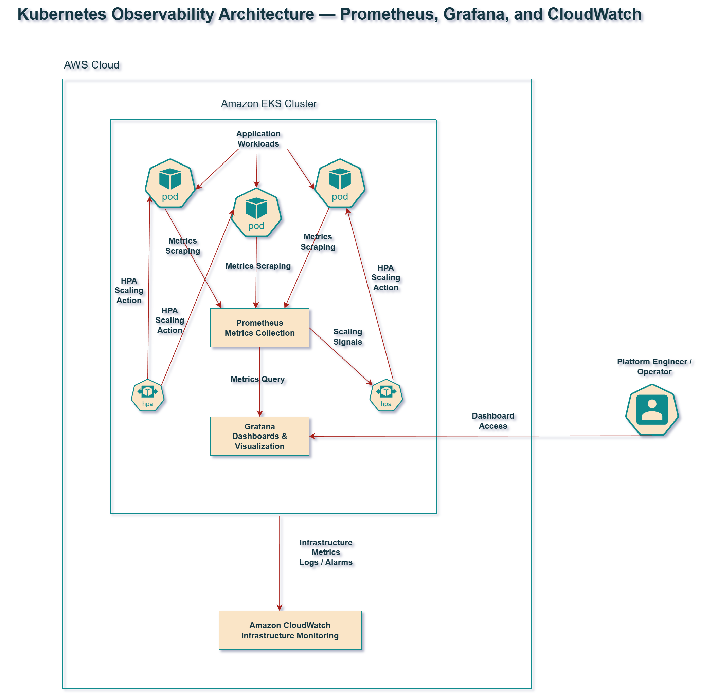
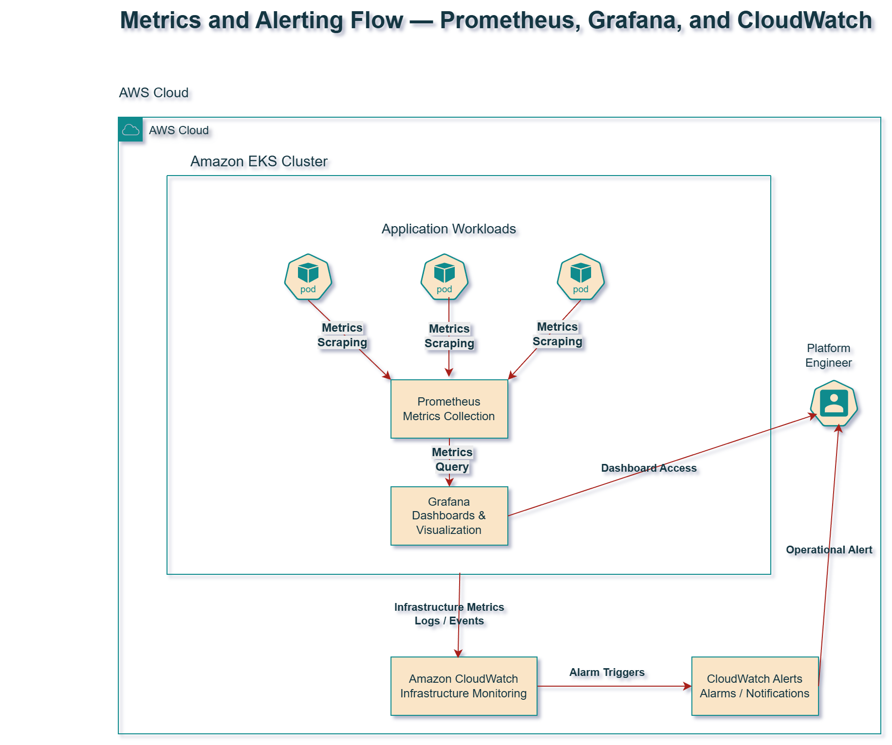
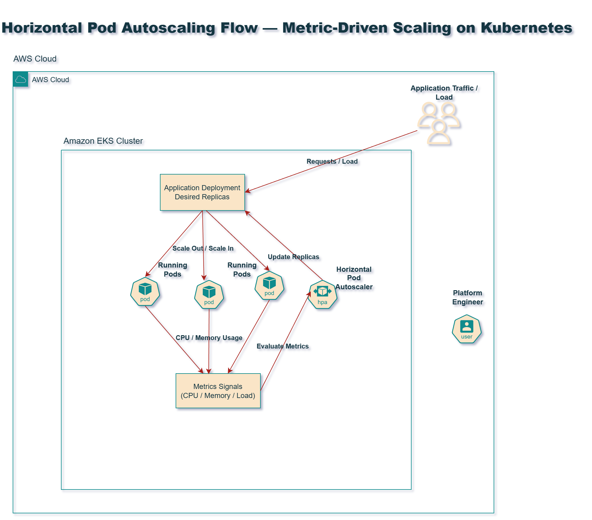

# Kubernetes Observability and Scaling Platform

This repository documents the observability and autoscaling architecture for operating Kubernetes workloads in a production-style platform environment.

The focus is on building operational visibility and reliable scaling behavior across a Kubernetes cluster running on AWS.

---

# Observability Architecture

The observability layer provides insight into:

- Kubernetes workloads
- cluster health
- infrastructure metrics
- application performance

Prometheus collects metrics from workloads and cluster components.

Grafana provides dashboards for visualization.

CloudWatch provides AWS-native monitoring for infrastructure components.

---

# Metrics and Alerting Flow

Metrics flow through the platform as follows:

1. Workloads expose metrics
2. Prometheus scrapes metrics
3. Grafana visualizes dashboards
4. CloudWatch monitors infrastructure signals
5. Alerts are generated when thresholds are exceeded

This model provides both application-level and infrastructure-level visibility.

---

# Autoscaling Architecture

Horizontal Pod Autoscaling allows workloads to scale based on demand.

The HPA controller evaluates metrics such as:

- CPU utilization
- memory usage
- request load

Based on these metrics, Kubernetes increases or decreases the number of running pod replicas.

This ensures applications remain responsive under load while minimizing resource waste.

---

# Documentation Map

## Platform Observability

- [Observability Architecture](observability-architecture.md)
- [Alerting Strategy](alerting-strategy.md)

## Scaling Design

- [HPA Scaling Behavior](hpa-scaling-behavior.md)

## Platform Operations

- [Incident Response Notes](incident-response-notes.md)
- [Lessons Learned](lessons-learned.md)

---

# Engineering Goals

This repository demonstrates how to design a Kubernetes environment that is:

- observable
- scalable
- operationally reliable
- capable of supporting production workloads

It complements infrastructure provisioning and GitOps delivery systems by focusing on runtime platform operations.